# NEON BREAKER · 霓虹打砖块

一个**单文件、零依赖、无构建**的 HTML5 Canvas 打砖块游戏。
整个游戏就在一个 `index.html` 里（**3838 行 / 166 KB**），没有任何外部图片、字体、音频或第三方库 ——
霓虹光效全部由 Canvas 2D 的阴影、渐变和自绘路径画出来。

> **在线玩**：<https://tong-xiangjie.github.io/neon-breaker/>
> 也可以直接双击 `index.html` 打开，不需要服务器。

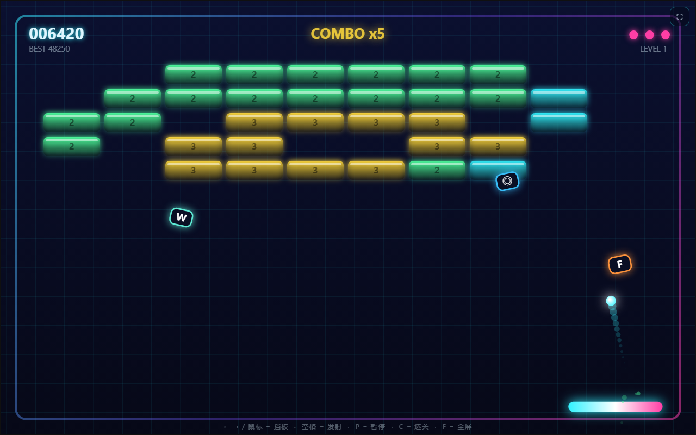

对局中：球带着拖尾、砖被打掉一批、场上飘着两个道具胶囊、右下角是连击数。

这个游戏真正的难点不是打砖块，而是**「球不能卡死」**——
砖块比格距窄（78 < 84），球的直径（14px）又比砖缝（6~7px）大得多，
所以球只能走"整格"，很容易掉进一个自洽的角度循环里出不来。
这个仓库里一半的设计文档（和绝大部分测试）都在处理这一件事，
从**引导层**（残局护送、角度拨正）一直做到**生成层**（保证每关都打得通）。

---

## 截图导览

`screenshots/` 里 15 张图**全部是真实游戏画面**（用 headless Chrome 打开真实的 `index.html` 截的，
不是手绘示意图 —— 做法见[截图是怎么来的](#截图是怎么来的)）。
图片上的标注是截图那一趟画在 Canvas 上的，每个数字都由 `_shot/probe-px.mjs` 逐像素回验。

| 图 | 图 |
| --- | --- |
| 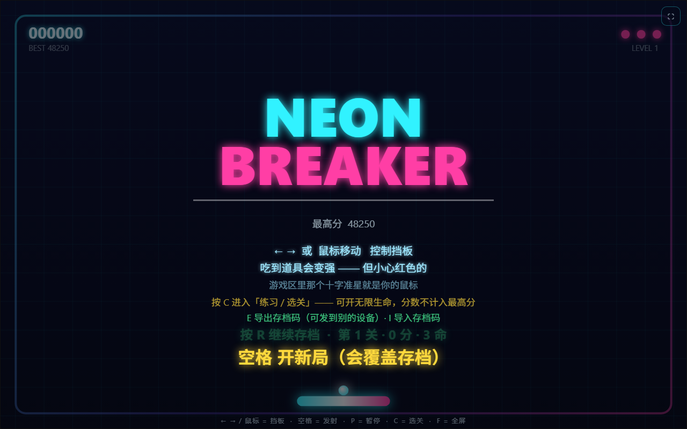<br>**01 标题界面** —— 霓虹标题、最高分、操作提示 | <br>**02 对局中** —— 拖尾、道具胶囊、连击 |
| 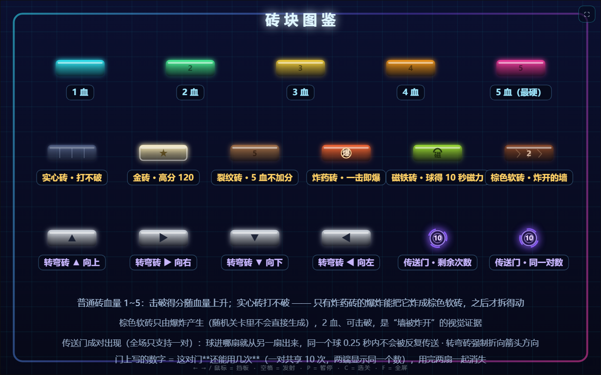<br>**03 砖块图鉴** —— 全部 17 种砖块值排在一起 | 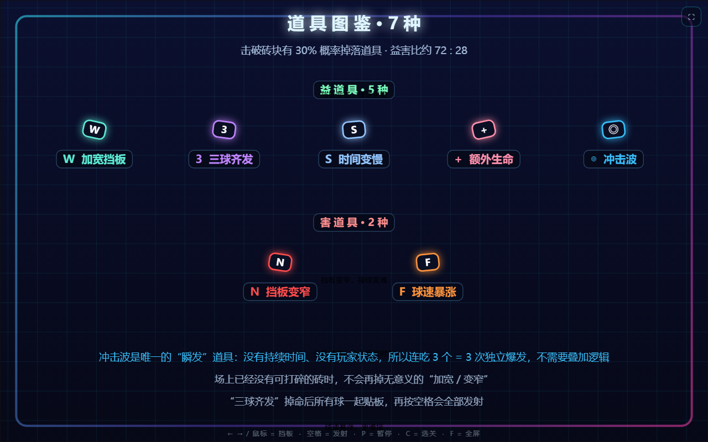<br>**04 道具图鉴** —— 7 种道具胶囊 |
| 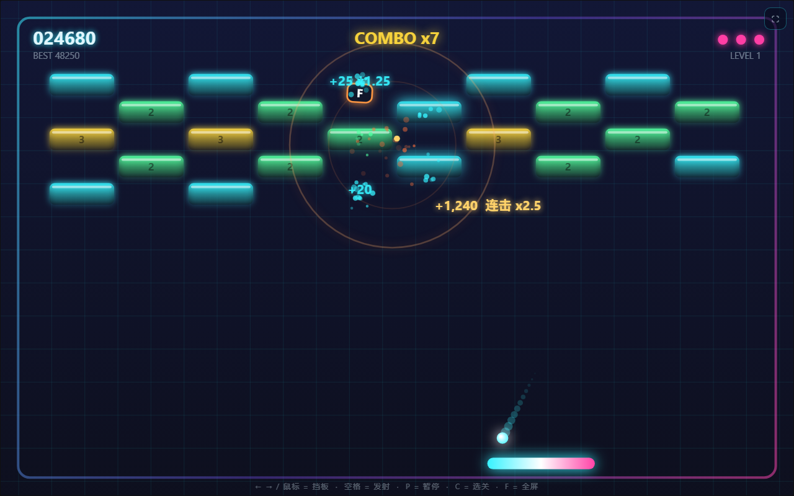<br>**05 爆炸与冲击波** —— 波前位置可被逐像素验证 | 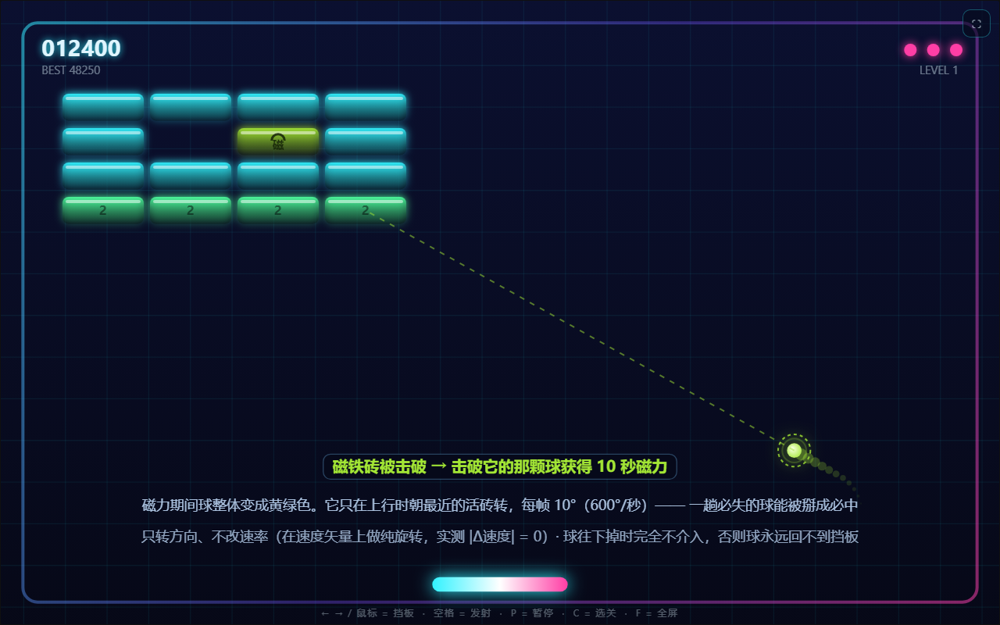<br>**06 磁力 buff** —— 球变色 + 绿色引导线 |
| 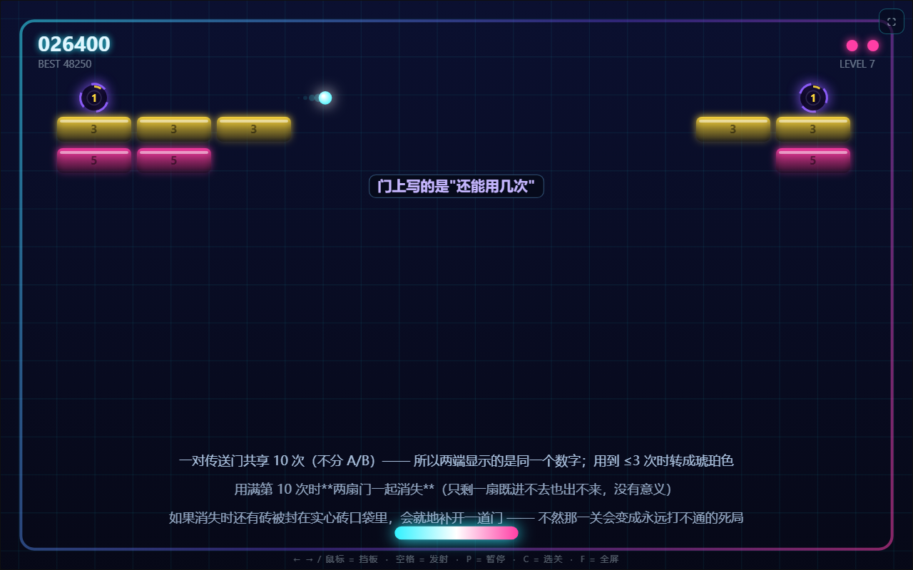<br>**10 传送门** —— 门上写的是**剩余次数**（一对共享 10 次） | 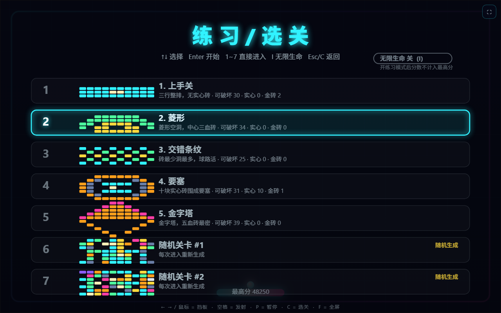<br>**07 选关** —— 练习模式、无限生命 |
| 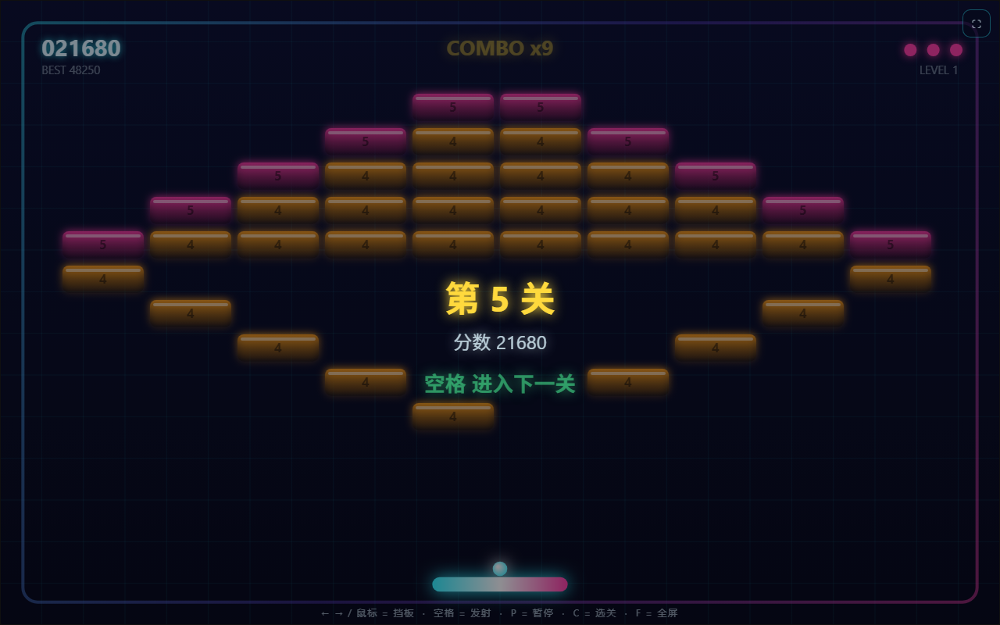<br>**08 通关** —— 结算与下一关 | 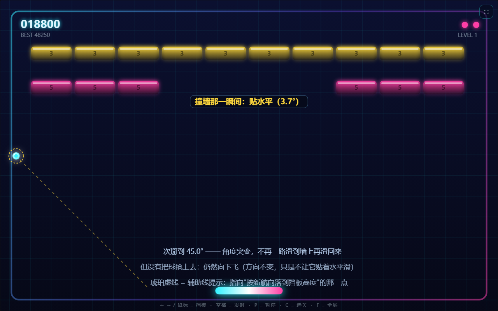<br>**11 贴水平拨正** —— 角度突变 + 琥珀辅助线 |
| 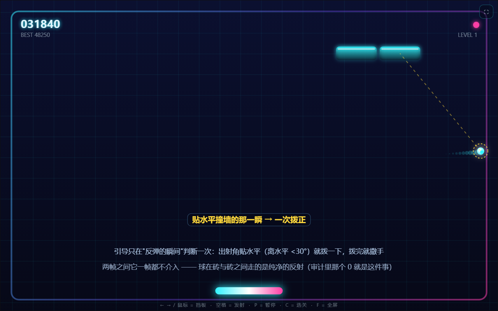<br>**09 残局护送** —— 最后几块砖时引导加强 | 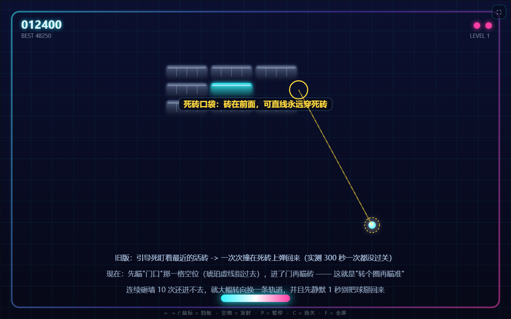<br>**12 死砖口袋** —— 护送改瞄"门口"而不是砖心 |
| 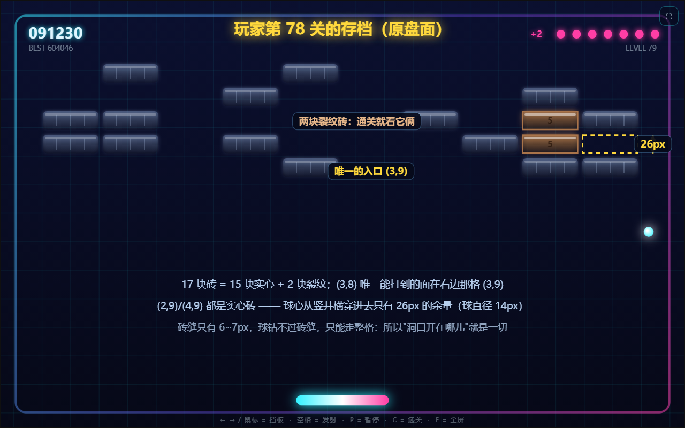<br>**13 玩家第 78 关存档** —— 洞口只有 **26px** | 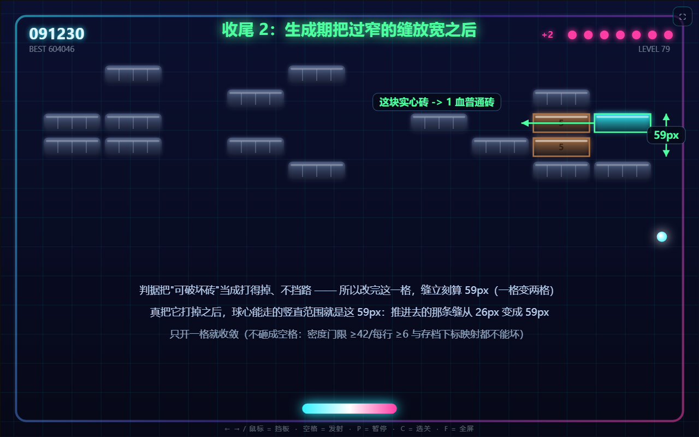<br>**14 收尾 2：放宽之后** —— 同一张盘面，缝变成 **59px** |
| 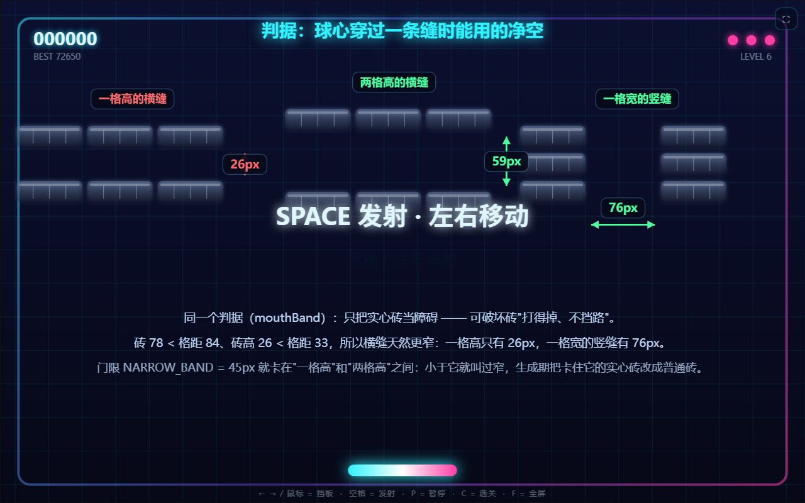<br>**15 判据的几何** —— 26 / 59 / 76px 是怎么来的 | |

---

## 目录

- [截图导览](#截图导览)
- [怎么玩](#怎么玩)
- [砖块一览](#砖块一览)
- [特殊机制](#特殊机制)
- [道具一览](#道具一览)
- [关卡](#关卡)
- [随机关卡的「随机性」是被约束的](#随机关卡的随机性是被约束的)
- [存档与分享](#存档与分享)
- [防卡死设计](#防卡死设计)
  - [触发条件：贴水平 + 只在反弹那一帧](#触发条件只有贴水平角度过小才引导而且只在反弹那一帧)
  - [强度：最后几块砖引导加强](#强度最后几块砖引导加强)
  - [卡关的一种：够不到的可破坏砖](#但有一种卡关是引导救不了的够不到的可破坏砖)
  - [卡关的另一种：三面被围、只留一格开口](#但三面被围只留一格开口是补开门管不到的--而引导自己会在这里死循环)
  - [第四轮反馈：生成期把过窄的洞放宽](#第四轮反馈引导再聪明也还是弹来弹去--那就改生成器把过窄的洞放宽)
- [截图是怎么来的](#截图是怎么来的)
- [目录结构](#目录结构)
- [验证](#验证)

---

## 怎么玩

打光场上所有**可击破**的砖就过关。实心砖和传送门不算数（打不掉），
但你也不用管它们 —— 通关判定只看「还有没有打得掉的砖」。

鼠标和键盘都能玩，可以随时互换：动一下鼠标就交出控制权给鼠标，按一下键盘就还给键盘。

| 操作 | 键 |
| --- | --- |
| 移动挡板 | 鼠标移动 / `←` `→` |
| 发射球 / 开始 / 下一关 | `空格` 或 `回车` |
| 暂停 | `P` 或 `Esc` |
| 选关（练习模式） | `C` |
| 继续存档 | `R` |
| 存档 / 读档 / 删档 | `F5` / `F9` / `Delete` |
| 导出 / 导入存档码 | `E` / `I` |
| 静音 | `M` |
| 全屏 | `F` |

选关界面里：`↑` `↓` 选择，`空格`/`回车` 进入，`1`~`7` 直接跳，
`I` 切换无限生命，`Esc`/`C` 返回。

生命周期：**3 条命**，球掉下去扣一条，扣完游戏结束（练习模式下不扣命、不结束）。

---

## 砖块一览


*（图鉴：把游戏里全部 17 种砖块值排在一起渲染，并加上标注）*

| 砖块 | 耐久 | 说明 |
| --- | --- | --- |
| 1~5 血普通砖 | 1~5 | 场上最常见的砖，颜色按血量区分；击破得分随血量上升 |
| 实心砖 | ∞ | **打不破**。只有炸药砖的爆炸能把它变成「棕色软砖」，之后才拆得动（冲击波不拆墙，见下） |
| 金砖 | 1 | 一击即碎，基础分 120（普通砖的 1.5~6 倍）。掉落逻辑和普通砖一样，**不保证掉道具** |
| 裂纹砖 | 5 | 纯障碍：破掉**不加分、不累计连击、不掉道具**，但不清掉就不能过关 |
| 转弯砖 ▲▶▼◀ | 2 | 球撞上后被强制折向箭头方向，无视入射角 |
| 棕色软砖 | 2 | **只由爆炸产生**（随机关卡不会直接生成），是「墙被炸开」的视觉证据 |
| 炸药砖 | 1 | 一击即爆，在自身位置放一圈爆炸（见下） |
| 磁铁砖 | 2 | 击破它的**那颗球**获得 10 秒磁力（球变色、会自己找砖） |
| 传送门 | ∞ | 成对出现，球进哪扇就从另一扇出来；全场只支持一对。**一对共享 10 次**，用满两扇一起消失 |

> 实心砖和传送门都属于 **furniture**：不参与通关判定，也永远不掉落。

### 传送门的次数：一对共享 10 次，用满就消失

传送门不是无限资源。**一对门共享一个计数器**：传过去算一次，再传回来也算同一次里的
一格，满 **10 次**之后两扇门**一起消失**。


- **为什么一对共享（不分 A/B）**：它们是"一对装置"，玩家在门之间来回穿。
  如果按 A/B 各算 10 次，一对门实际能用 20 次，和"传送门是有限资源"的设计意图不符。
- **为什么两扇一起消失**：只剩一扇门既进不去也出不来，留着只是个画着圆环的空格子。
- **门上标的就是剩余次数**（原来标的是 A/B 字母）。次数既然不分家，"哪个是 A"
  对玩家已经没有意义了，而"还剩几次"是真正影响决策的信息。
  两端显示的是**同一个数** —— 这本身就是在告诉玩家"它是一对、共享一个额度"。
  剩 ≤3 次时数字和门内那道剩余弧一起转成琥珀色。
- **次数跨越掉命保留**：掉一条命不会给门充能（关卡没重铺，门的状态就不该重置）。
- **不写进关卡码和存档**：分享出去的关卡码只描述盘面，门是新的一对、次数重新给满。
  这是有意的 —— 关卡码是"盘面"，不是"某个人的进度"。

#### 门消失时如果刚好把砖封死了，会就地补开一道门

这条是必须的，不然新规则会打开一个旧的安全漏洞。

`openTrappedBricks`（见「够不到的可破坏砖」一节）把「**口袋里有一扇门**」当作可达 ——
因为球会被传送进去。门是用得完的，那条判定迟早会作废：如果门消失时口袋里还留着
没打掉的砖，这一关就变成了**永远打不通的死局**。

所以门耗尽时会**补跑一次同一套"开门"逻辑**（`repairAfterPortalLoss`）：
把这一关的格子快照里两扇门清成空位，重新算一次可达性；真的又出现够不到的砖时，
就把封住它的那块实心砖改成普通砖 —— 和开局那次修复用的是同一个函数，
不另写一份判定，避免两处漂移。平时（没有口袋）它一次都不动，而且是幂等的。

```
ok   前提：口袋真的是封死的（四正交邻居全是实心砖）
ok   前提：有门的时候口袋算可达，生成期不额外开门
ok   ★ 门耗尽后补修复开了一道门（实心砖 -> 可破坏砖）
ok   （同上）开的门贴在口袋边上（是口袋那一圈的实心砖）
ok   （同上）新开的门是可破坏的普通砖，不是空格也不是软砖
ok   （同上）口袋里的砖重新变成"够得到"
ok   补修复是幂等的（再跑一次不会继续拆墙）
ok   ★ 门耗尽之后这一关仍然能打通（门不阻碍通关）
```

---

## 特殊机制

### 冲击波（道具 `◎`）


吃到就在**球当前的位置**放一圈扩张的波，清掉邻近的砖。

- 波心锚在**球**上，不是挡板。砖区在顶部、挡板在底部，相距约 420px，
  锚在挡板上波永远够不到砖，等于白吃；而且这个道具的定位是「球快掉了那一瞬间的救命手段」。
- `forceSolids: false` —— 道具版只负责**清场**，不负责**拆墙**。拆墙是炸药砖的职责，
  两者分工不同，否则冲击波会变成一把万能钥匙。
- 它是唯一的**瞬发**道具：**没有持续时间、没有玩家状态**。
  所以连吃 3 个天然就是 3 次独立爆发，不需要任何叠加或进化逻辑。

### 爆炸（炸药砖）

炸药砖被打掉时，在自身位置放一圈从 12px 扩张到 150px 的环，
沿途炸掉砖块、并把命中的实心砖改成棕色软砖（于是「打不破的墙」变成了「可以拆的墙」）。

两条刻意的限制：

- **炸药砖引爆炸药砖只允许连一级**（用 `explodingDepth` 阻断）。
  否则一排炸药砖会连锁掉半屏，分数和连击都失控。
- 一次爆炸对连击的推进**最多 4 级**（`COMBO_PER_EXPLOSION`），
  否则「一炸 15 块」会让倍率直接冲到 3 倍以上，后面的分数全乱。

### 磁力 buff（磁铁砖）


击破磁铁砖的那颗球获得 **10 秒磁力**（`MAGNET_LIFE`），期间它**主动朝最近的活砖修正航向**。

这一版是**刻意替换掉旧「引力井」**的。旧机制是「打掉磁铁砖 → 原地留一个引力井，
路过的球被轻轻吸一点」，实测下来两个问题都很致命：

- **偏转太小**：460px/s 的球从井心 60px 外经过只被偏转 **6.2°**；球越快越小
  （1000px/s 只剩 1.3°）。而球每次撞挡板都会加速 1.2%，所以后期等于没有。
- **几乎碰不到**：逐帧统计 5 分钟真实对局（第 20 关），球落在井半径内的时间只占
  **0.2%~0.6% 的帧** —— 井开在砖区，而球大部分时间在中下部飞，井还只活 8 秒。

现在的磁力是玩家**看得见、能依赖**的：

| 指标 | 旧：引力井 | 新：磁力 buff |
| --- | --- | --- |
| 触发方式 | 打掉砖后地面留一个场 | 打中的**那颗球**自己带 buff |
| 作用对象 | 路过的任何球 | 只有吃到 buff 的球 |
| 单次效果 | 偏转 1.3°~6.2° | 每帧 10°（**600°/秒**），一趟上行最多可转 **524°** |
| 持续时间 | 8 秒（场） | 10 秒（球） |
| 可见性 | 地上一个环，球的行为看不出变化 | **球整体变黄绿**并带脉冲环 |

磁力的强度（`MAGNET_TURN`）不是拍脑袋定的：它是**防卡死引导基准的 2.5 倍**
（引导基准 4°/帧 → 磁力 10°/帧），也就是「磁力球用引导的 2~3 倍加强版」。
这是刻意让磁力**明显强于**残局引导：引导只在最后几块砖时兜底，而磁力是
打掉磁铁砖换来的奖励，玩家花了操作就该拿到「这段时间球自己会找砖」的确定性。

受控实验（中间 8 列留空、只有最左最右各 2 块砖，球从 y=520 竖直上飞）：

```
  离轴     无磁力    有磁力    达成用时   横移量    撞击前航向   磁力累计转角  速率变化
  0px      打不到    打到      1.07s      279px     -53.9°       36.1°         0.000000px/s
  80px     打不到    打到      0.98s      203px     -62.3°       27.7°         0.000000px/s
  160px    打不到    打到      0.92s      126px     -72.1°       17.9°         0.000000px/s
  240px    打不到    打到      0.88s      49px      -82.9°       7.1°          0.000000px/s
```

也就是说：**不打磁铁砖时这 4 条轨迹全部从空档穿过去、一趟都打不到砖；
拿到磁力后 4 条全部命中。** 这正是「减少人力控制」要买的效果。

两条硬约束（都有测试守着）：

- **只转方向、不改速率**：转身是在速度矢量上做**纯旋转**（`b.vx = cos(na)·sp`），
  实测全程 |Δ速度| = 0。它不会变成加速器。
- **只在上行时介入**（`b.vy < 0`）：否则球会被一直修正到永远掉不下来，
  等于删掉了失败条件。球往下掉时磁力完全不介入，但**计时照常流逝**，所以 buff 一定会到期。

还有一条玩家反馈后补上的选目标规则：**不瞄「直线打不着」的砖**。

原来的取目标函数只看距离（`nearestBrick`），于是会出现这种事：球正上方是一块**死砖**，
死砖**后面**还有一块可破坏砖 —— 按距离算，最近的是后面那块，磁力就一路把球往那个方向掰，
结果球一次次撞在死砖上弹回来。玩家看到的现象就是「**磁力的引导在瞄死砖**」。

现在改用 `nearestAimBrick`：它先用 Liang-Barsky 线段裁剪判一条视线
（球心 → 候选砖中心，向外留 2px 余量），**隔着死砖的目标直接跳过**，取下一个最近的；
如果一块都够不着就**这一帧不掰**（磁力是奖励，宁可不动也不把球往死砖上送）。
同一张盘面的 A/B（1800 帧，只换瞄准函数）：

| 盘面 | 旧：只看距离 | 新：加视线筛选 |
| --- | --- | --- |
| 球在死砖正下方 | 撞死砖 **6** 次 | 撞死砖 **1** 次 |
| 球在右下斜向 | 撞死砖 **5** 次 | 撞死砖 **0** 次 |

> 防卡死护送的两跳绕路那一问也用了同一个函数，**带兜底**（`fallback=true`）：残局里所有活砖
> 都被挡住时退回「最近的活砖」，再拿它去找门口。因为绕路本来就是让球**绕过**实心墙
> 进的，严格筛会把目标一起筛掉。（第 1 问「直线打得着吗」是**严格**的：打得着才瞄砖心。）

另外，磁力现在有一条**绿色引导线**（和防卡死的琥珀色引导线同构，用颜色区分是谁在掰球）：
球外面套一个绿色虚线环，再从球拉一条绿色虚线指向它正在瞄的那块砖。


这条线的目标**不是画的时候重算的**，而是 `applyMagnet` 这一帧真正用的那个目标
（记在球的 `magTarget` 上）—— 画的和掰的必须是同一个目标，否则那条线就是在骗玩家。
琥珀色的防卡死引导线同理（`b.aimTarget`）。

转向权限随之涨了 4.5 倍（旧值 2.2°/帧）：

| 球速 | 飞到砖行用时 | 期间最多可转（旧 2.2°/帧） | 期间最多可转（新 10°/帧） |
| --- | --- | --- | --- |
| 300 px/s | 1.34s | 177° | **804°** |
| 460 px/s | 0.87s | 115° | **524°** |
| 700 px/s | 0.57s | 76° | **345°** |
| 1000 px/s | 0.40s | 53° | **241°** |

> 注意「累计转角」那张表里的数字（7°~36°）**没有**跟着涨 4.5 倍 —— 因为
> 需要的转角是由几何决定的：航向误差只有约 47°，对准之后就直着飞过去了。
> 涨的是**转向权限**（524° vs 115°），也就是「多斜的球都掰得回来、掰得更快」。
> 10°/帧 意味着转过 90° 只要 9 帧（0.15 秒），所以截图里那道拖尾是
> **先快速弯一下、再直着冲向砖**；为了让弧线在画面上仍然看得见，
> 演示场景特意用了一个约 116° 的大初始航向误差。

### 连击

连续击破砖块会累积连击，**2.2 秒**内没有新击破就清零。

```
倍率 = 1 + min(连击数 - 1, 9) × 0.25      // 最高 x3.25
得分 = 基础分 × 倍率
```

基础分：普通砖 `20 + (血量-1) × 15`（1 血 20 分 → 5 血 80 分），金砖 120，炸药砖 60。

---

## 道具一览


*（图鉴：把 7 种道具胶囊排在一起渲染，并加上标注）*

击破砖块有 **30%** 概率掉落道具，益害比约 **72 : 28**。

| 道具 | 效果 |
| --- | --- |
| `W` 加宽挡板 | 挡板宽度 +42px（上限 260px） |
| `3` 三球齐发 | 一次发三颗球 |
| `S` 时间变慢 | 球速 ×0.68（**永久**，4 秒的 `SLOW MOTION` 字样只是提示） |
| `+` 额外生命 | 生命 +1 |
| `◎` 冲击波 | 立刻在球的位置放一圈波（见上） |
| `N` 挡板变窄 | 挡板宽度 −34px（下限 60px）—— **害** |
| `F` 球速暴涨 | 球速 ×1.32，夹取到 400~1000px/s —— **害** |

两条设计约束：

- **没有「道具等级」**。吃到 3~4 个同名道具必须天然可用：
  加宽/变窄是纯数值夹取，三球是数量，冲击波是无状态瞬发 —— 都不需要叠加规则。
- **无效掉落会被过滤**。挡板已经最长时不会再掉 `W`、已经最短时不会再掉 `N`
  （`powerIsNoop()`）—— 吃到也不会有任何变化，只会白占一次掉落机会。

---

## 关卡

5 个手工设计的关卡 + 2 个随机关卡入口：

| # | 名称 | 布局 | 特点 |
| --- | --- | --- | --- |
| 1 | 上手关 | 3 行 · 可破坏 30 | 三行整排，无实心砖 |
| 2 | 菱形 | 5 行 · 可破坏 34 | 菱形空洞，中心三血砖 |
| 3 | 交错条纹 | 5 行 · 可破坏 25 | 砖最少洞最多，球路最活 |
| 4 | 要塞 | 7 行 · 可破坏 31 · 实心 10 | 十块实心砖围成要塞 |
| 5 | 金字塔 | 10 行 · 可破坏 39 | 金字塔，五血砖最密 |
| 6 / 7 | 随机关卡 | 5~7 行 · 可破坏 ≥42 | 每次进入重新生成（内部关号分别是 **5** 和 **8**，见下） |


打完 5 关后 `nextLevel()` 会把关号一直往上加（6、7、8……），
所以难度分档是按**内部关号**递增的：

| 内部关号 | 新增内容 |
| --- | --- |
| 1~6 | 只有普通砖 / 实心砖 / 金砖 |
| 7 起 | 转弯砖（最多 6 块） |
| 11 起 | 裂纹砖（2~8 块，纯障碍不加分） |
| 13 起 | 炸药砖（最多 4 块） |
| 17 起 | 磁铁砖（最多 3 块） |

传送门则是每一关都可能出现（概率随关号从 35% 升到 80% 封顶）。


*（第 5 关「金字塔」打完的通关结算）*

---

## 随机关卡的「随机性」是被约束的

一开始的随机关卡「确实完全没有随机」—— 后来重新设计，但**不是简单地放开随机**，
而是先立了几条硬约束，再在约束内做变化（否则随机很容易随机出「稀疏到打不到」的关卡）：

| 约束 | 值 | 为什么 |
| --- | --- | --- |
| 总砖数下限 | **42** | 用户要求：砖块最少不少于最大数量（10 列 × 7 行 = 70）的 **60%** |
| 每行砖数下限 | **6** | 不允许出现「稀疏到空行」的关卡 |
| 砖区底边到挡板净空 | **≥180px** | 球从砖底弹回挡板的来回趟数不够时，玩家来不及反应 |
| 传送门 | 恰好一对 | 引擎只支持一对（`portalA`/`portalB` 是单例），落单的会被清掉并就地补一块砖 |
| 左右镜像 | 部分风格 | 右半来自左半，形状一眼看得出是「设计过的」 |

生成末尾有一段固定顺序的收尾，顺序本身是有讲究的：
`repairRows`（消掉没有可破坏砖的漏斗行，优先补空格以免拆散传送门）
→ `topUpRows` → `fixPortals`（补砖而不是留空，否则密度门限守不住）
→ `addBricksToDensity`（最后兜一次总砖数，只填空格、只加不减）
→ `openTrappedBricks`（保证每块可破坏砖都够得到）
→ `widenNarrowPockets`（把"洞口开着但缝太窄"的洞放宽一格）。
后两道是**可通关性的最后保证**，只动盘面、不碰球的轨迹；
它们只把实心砖改成 1 血普通砖，所以格子仍非空、门限与存档下标都不受影响
（详见「够不到的可破坏砖」那一节）。

> 净空那条约束只管随机关卡（`G.level >= 5`），5 个手工关卡是有意豁免的 ——
> 第 5 关「金字塔」铺到 10 行时，砖区底边到挡板只剩 **141px**（实测），
> 这是紧凑布局的代价，由人来摆所以可以接受。

---

## 存档与分享

- 自动存档：游戏中**每 60 秒**写一次，另外关标签页前也会存一次。
- `F5` 存档 · `F9` 读档 · `Delete` 删档。存档存在 `localStorage`，
  所以**地图本身**要一起存（随机关卡只存砖块下标是不可靠的）。
- `E` 导出**存档码**（纯文本），`I` 导入 —— 跨设备就靠这个，支持 `Ctrl+V` 直接粘贴。
- 练习模式（`C` 进入选关开的局）的分数**不计入最高分**。

> **玩家发来的一张存档码，直接变成了这个项目最好用的测试夹具。**
> 第 78 关那张盘面（下图）就是从一句"还是非常卡"和一个 `NB1-…` 分享码开始的：
> 解出 5×10 的格子、17 块砖（15 块实心 + 2 块裂纹），
> 后来它同时钉住了三件事 —— 护送要瞄"洞口那一面"、要会借一次墙、
> 以及生成期不该产出这种只有 26px 的洞。
> 你玩到卡住时按 `E` 把存档码发过来，比描述一百句都管用。


---

## 防卡死设计

打砖块最容易出现的问题是「球陷入一个自洽的角度循环，永远打不到最后一块砖」。

这里有一个**必须先讲清楚的取舍**：防卡死的「引导」会**改变球的轨迹**，
也就是让玩家看到不遵守反射定律的运动。第一版把它全程开着，实测代价是：

| | 第 1 关 | 第 20 关 |
| --- | --- | --- |
| 停滞计时器 > 5s 的帧 | 13.3% | **39.3%** |
| 挡板反弹被引导改写方向的比例 | 4.2% | **20.1%** |
| 被改写时偏离游戏自己出射角规则的平均值 | 57.9° | **74.7°** |
| 关掉引导后，偏离出射角规则的平均值 | 1.0° | 1.0°（超过 15° 的从 20.1% → 0%） |

而且它介入得非常频繁（当时的旧版是每帧最多转 4°，约 **240°/秒**），
旧注释里写的「正常玩法几乎感知不到」是错的。
根因是重置条件太松：只有**打碎**砖块才清零停滞计时，于是「反复啃一块多血砖」
会一直累加计时器，引导就全程挂着了。

现在的做法是**五层引导 + 两道生成期收尾**，且第一层只在残局介入：

1. **引导（只在残局）**：场上可破坏砖 **≤ 3 块**（`ASSIST_MAX_BRICKS`）时介入，
   按 `nearestBrick()` 朝最近的活砖柔性修正。**任何一次打中砖**（不要求打碎）
   都会把停滞计时清零。残局之外**完全不介入** —— 玩家看到的轨迹就都是真正的反射。
   介入的**触发条件**和**强度**见下面两节。
2. **竖直循环纠正**：横向速度占比持续低于 10% 达 **5 秒**时，在挡板反弹处施加微小扰动，
   打断「一直垂直上下」的死循环。
3. **强制重发**：停滞 **40 秒**直接把球召回挡板、以全新角度重发。
   40 秒空等本身已经很难受，但这一步对正常玩法完全不可见。
4. **连续砸墙 10 次就「转个圈再瞄准」**（残局，玩家点名要的）：连续 10 次反射
   （撞墙或撞死砖都算）都没碰到任何可破坏砖，就换一块打得着的砖来瞄；
   一块都打不着就大幅转向 ±70°~110° 换一条轨道，并静默 1 秒。
5. **护送瞄哪儿：按「砖心 → 洞口那一面 → 借一次墙 → 两跳绕路」四问，再不行才转个圈**
   （第三轮反馈催生的）：砖躺在口袋里时，"瞄最近的活砖"只会让球一次次撞死砖。
   怎么算「洞口」、为什么借一次墙能进"一格宽的洞"，见下面「三面被围」那一节。
6. **生成期的两道收尾**（不碰轨迹，只动盘面，跑在 `pattern()` / `loadLevel()` 里）：
   ① 保证每一块可破坏砖都**够得到**（`openTrappedBricks`）；
   ② 把「洞口开着、但缝太窄」的洞**放宽一格**（`widenNarrowPockets`，第四轮反馈）。
   见下面「够不到的可破坏砖」那一节。

#### 触发条件：只有「贴水平角度过小」才引导，而且只在**反弹那一帧**

这条规则改过三轮，现在的形态是第三轮的结果。三轮的输入都是同一句抱怨，但指向不同：

| 轮次 | 玩家说 | 改动 |
| --- | --- | --- |
| 1 | 「横向/竖向角度小于 30° 就应该主动引导」 | 加角度触发，但和计时器一起关在残局门控里 |
| 2 | 「小角度还是没有掰弯」 | 把角度触发从门控里放出来，全程有效（**每帧**朝目标转一点点） |
| 3 | 「为什么会一直有引导线？」→「如果拨正了就不要一直管了，只有检测到某次**反弹的瞬间**角度不对就引导一下」→「只用管水平角度过小，竖直的没问题」 | ① 改成**事件**：只在反射那一帧拨一次；② 收窄成**只管贴水平** |

现在的规则（`flatAngle()`）覆盖的只有**贴水平**：航向离水平不到 30°：

| 角度 | 算「角度不对」吗 | 为什么 |
| --- | --- | --- |
| 贴**水平**（离水平 < 30°） | **是** | 球在左右墙之间横着弹，永远落不到挡板，玩家完全没法干预 |
| 贴**竖直**（离竖直 < 30°） | **不是** | 那是正常打法的主流方向 —— 球上下弹照样会碰到砖、也会回到挡板 |

「竖直不算」不是口味问题，是数据问题：挡板模型是 `rel × 60°` 偏离竖直，
「离竖直 30° 以内」覆盖了正常打法的**一大半**（第 1 关 91% 的帧，其中 75-90° 占 69.6%、
60-75° 占 17.8%）。把它也算成「角度不对」，等于**全程自动瞄准**——
第二轮那个「介入占 10.6% 的帧、引导线 30.6% 的时间亮着」就是这么来的。

而且它是**事件**，不是**过程**：只在墙 / 砖 / 挡板反射发生的那一帧判断一次。

```js
// 反射的那一帧才被调用。出射角正常就完全不引导；不对就拨一次，然后撒手。
function reflectNudge(b, exclude){
  if (b.turnLock > 0) return false;        // 刚被转弯砖改过向，让路
  if (b.vy > 0) return false;              // 正在下落 = 该回挡板，别抢玩家的球
  const stuck = assistGate() && G.stuckTimer > 5;
  const wasFlat = flatAngle(b.vx, b.vy);
  if (!wasFlat && !stuck) return false;    // ← 出射角正常（含贴竖直）→ 一帧都不动
  if (wasFlat){ /* 拨向目标砖，但拨完至少离水平 35° */ }
}
```

| 触发方式 | 生效范围 | 性质 |
| --- | --- | --- |
| **角度触发**（贴水平） | **全程** | 它修的是「这一趟球白飞了」，中局和残局一样白飞 |
| **计时器触发**（停滞 > 5s） | 只在残局 | 它是「最后几块砖永远打不到」的兜底，中局放开会变成全程陪玩 |

**「事件 vs 过程」是这一轮的关键。** 旧版是过程：只要航向落在区间里就每帧都转，
0.2 秒的视觉残留被不停续上，屏幕上就是一条「一直在」的引导线。新版的角度规则是事件：
一次拨正只占**一帧**，两帧之间球走的是**纯净的反射** —— 标记亮一下就必须灭，
物理上不可能被续上。

第 1 关 300 秒同种子配对（`node shots.cjs 90-line`）：

| 指标 | 旧版（角度规则每帧转） | 现在：角度规则（事件） | 现在：残局护送（过程） |
| --- | --- | --- | --- |
| 介入 | 1915 帧 (10.6%) | **0 次**（第 1 关 300 秒里一次都没触发） | 242 帧 (1.3%)，只在残局停滞时 |
| 琥珀标记可见 | 5515 帧 (**30.6%**) | **0 帧** | 285 帧 (1.6%)，最长 3.6 秒 |
| 相邻介入间隔 < 12 帧 | **75.8%** | — | 100%（它本来就是每帧的） |

真实盘面的审计（`node shots.cjs 97-audit --probe`）独立验证了这条设计约束 ——
自由飞行（无碰撞 / 无磁力 / 无竖直强纠偏 / **无残局护送**）却被改动方向的帧：

```
第 1 关            0 (0.0%)      残局护送另计 1031 帧 (5.7%)
固定盘面 · 引导开   0 (0.0%)
固定盘面 · 引导关   0 (0.0%)
```

**这个 0 就是「拨正了就不要一直管」的形式化版本。**

> **必须说清的一件事：琥珀标记有三个来源，其中一个仍然是「一直亮」的。**
> 审计里的归因是直接的（看最近 12 帧是谁点的火），修完下行漏洞与「转个圈」之后是：
>
> ```
> 第 1 关            残局护送 99.5%   角度拨正  0.0%   转个圈 0.0%   其余 0.5%   （可见 376 帧）
> 固定盘面 · 引导开   残局护送 70.0%   角度拨正 16.3%   转个圈 4.4%   其余 9.3%   （可见 270 帧）
> 固定盘面 · 引导关   残局护送  0.0%   角度拨正 91.7%   转个圈 0.0%   其余 8.3%   （可见  36 帧）
> ```
>
> 也就是说，这一轮砍掉的是**角度规则**的常亮（30.6% → 0%），
> 而**残局护送**依旧每帧介入、依旧把标记续上（第 1 关 6.3% 的帧、最长一段 3.6 秒）。
> 这是刻意的（理由见下一节：护送要绕过实心砖把球弄进口袋，那件事停不下来），
> 但它意味着**看到一条持续亮着的琥珀线时，玩家分不出是哪一种**。
> 目前的区分只有时长和亮度（0.2 秒闪一下 = 一次拨正；0.35 秒且更亮 = 一次「转个圈」；
> 持续 = 残局护送）。要不要给几种介入配不同颜色，是个待定的视觉决定。
>
> （`audit()` 现在**固定种子**了 —— 之前每次跑出来的百分比都不一样，"改前 / 改后"没法比。）

##### ⚠️ 但玩家实测报了一个漏洞：贴水平**下行**的球从来没被管过
> 「接近水平的轨迹还是没有防卡处理！应该角度突变+辅助线提示」

**玩家是对的，而且我上一轮的结论是错的。** 上一轮我在**第 1 关**上做 A/B，
读到"这条规则 300 秒里一次都没触发，过关数逐种子完全相同"，于是写成
「**这条规则其实是张安全网**」。那个结论建立在一个不具代表性的样本上：
**第 1 关是设计关卡，没有转弯砖。**

第 1 关的球出射角被 `maxVx = sp*0.86` 钉在离水平 30.7° 以外，而墙/砖反射
只翻转分量符号、不改变这个比值 —— 所以在**没有转弯砖**的盘面上，
贴水平几乎不可能出现。可一旦盘面里有**转弯砖**，它会把球强行折向箭头方向
（包括**纯水平**），贴水平就成了一种常态。实测第 20 关最长的一段：
球以 `(-543, 18)`（离水平 1.9°）在两面墙之间滑了 **2406 帧 = 40.1 秒**。

而且 `reflectNudge` 的第一条判据正好把这类样本**整个放过**：

```js
if (b.vy > 0) return false;   // 正在下落 = 该回挡板，别抢玩家的球   ← 旧版
```

这句话对**正常斜着下落**的球完全正确，对**贴水平下落**的球却是错的：
它不是在回挡板，它是在两面墙之间来回滑。第 20 关 300 秒里，
3067 个贴水平帧中 **2976 帧是下行**，58 个"贴水平的反射瞬间"里
**38 个死在这一条上**。

###### 修法：下行的贴水平球**只把下滑角掰陡，方向一动不动**


- **角度突变**：一次掰到 **45°**（不是"每帧转一点点"）——
  球速 `(-420, 27)`（离水平 3.7°）→ `(298, 298)`（**45.0°**）。
- **不抢玩家的球**：`vy` 的符号和 `vx` 的方向都保持不变 ——
  它本来就要回挡板，我们没有把它转去朝上的砖，只是不让它在墙上滑 40 秒。
- **辅助线提示**：`aimTarget` 指向「按新航向落到挡板高度」的那一点
  （`y = 554`，也就是挡板所在的 y），琥珀虚线把这件事直接画给玩家看。
- **正常斜着下落（离水平 30° 以上）的球依旧完全不碰** —— 修的是贴水平，不是"所有下行球"。
  这条单独有断言：45° 斜向下的球调 `reflectNudge` 必须返回 `false` 且速度一字节不变。

###### 30 个关卡 × 60 秒，同种子配对（`node shots.cjs 98-flat --probe`）

A/B **只差这一条判据**（旧 = 复现 `if (b.vy > 0) return false;`，新 = 现在的实现）：

| | 旧（下行放过） | 新（掰陡下滑角） |
| --- | --- | --- |
| 贴水平帧占比 | **13.5%** | **2.3%** |
| 最长的一段连续贴水平 | **36.2 秒** | **1.8 秒** |
| 超过 3 秒的段 | **15 段** | **0 段** |

重灾关卡（旧 → 新）：

```
第 14 关:  77.2% / 最长 36.2s   ->   5.1% / 1.1s
第 20 关:  68.2% / 最长 16.7s   ->   6.8% / 1.2s
第 22 关:  52.1% / 最长 21.9s   ->   5.2% / 1.2s
第 19 关:  44.5% / 最长 19.5s   ->   9.0% / 1.5s
第  1~8 关:  0.0%（设计关卡，没有转弯砖 —— 我上一轮只量了这里）
```

**残留的 2.3% 是什么**：转弯砖把球折向水平之后的**那一段**。
转弯砖有 0.35 秒的"让路窗口"（箭头说了算，这是有意的），
窗口内不动它；窗口外的**第一次反射**就会掰陡。所以残段最长 1.8 秒、
没有一段超过 3 秒 —— 要再短就只能回到"每帧都管"，而那正是玩家否掉的东西。
这个取舍是刻意的，写在这里而不是悄悄留着。

> **测量纪律第六条：**一个关卡不是样本。
> 我上一轮拿**第 1 关**去代表整条规则，得出"它从不触发"，
> 而第 1 关恰好是唯一一类**结构上不可能触发**的盘面（无转弯砖）。
> 一条"防卡"规则的价值全在**病态盘面**上，量它就必须去有病态盘面的关卡量。
> 修完之后我把它改成了 30 关配对抽样 —— 这才是能支撑结论的样本量。

##### 为什么「残局护送」没有一起改成事件
第一版是把两条触发**一起**改成一次性拨正的，测试当场抓到了代价：

```
FAIL 被实心砖封死的盘面修复后真的能打通（300 秒内过关 ≥1 次）  -> 过关 0 次
```

12 次连跑里有 2 次读到「过关 0 次」（改动前 12 次全过）。原因是**职责搞错了**：

| | 角度规则（`reflectNudge`） | 残局护送（`escortToBricks`） |
| --- | --- | --- |
| 修的是什么 | 「这一趟航向不对」 | 「球还没到那个够不到的地方」 |
| 需要几次 | **一次就够**，然后必须撒手 | **停不下来** —— 绕过实心砖进到口袋里，只在反射那一帧拨一次会来回蹭却进不去 |
| 机制 | 事件（只在反射帧） | **过程（每帧）** |
| 触发 | 贴水平，全程 | 残局 + 停滞 > 5 秒 |

所以最后是**一条规则两种机制**：角度侧事件化（玩家要的），护送侧保持每帧（它本来就该是过程）。
代价是审计脚本的「自由飞行帧」判据必须显式排除护送帧 ——
否则它会把这个**刻意的**每帧介入误判成「角度规则偷偷在帧间介入」。

> **教训：**「把机制统一成一种形式」是很舒服的冲动，但同一条规则的两半可能在**数学性质**上
> 就不同（一次性修正 vs 持续导航）。判断依据只能是职责，不是形式上的整齐。
> 而抓到它的恰好是那条最不「单元」的端到端断言 —— 只有单元测试的话，这次退化会直接上线。

> **后续（见「三面被围」那一节）：** 这张表里「绕过实心砖进到口袋里」当时只是**意图**，
> 实现上仍是"瞄最近的活砖"，所以那件事其实从来没做成 ——
> 砖躺在口袋里时那条直线一定穿死砖，护送 95.4% 的帧都在瞄一堵墙。
> 现在它真的会绕了：先奔**门口**（两跳），进不去再"转个圈"。

###### 顺手抓到并修掉的一个自相矛盾

新规则第一版有个毛病：它拨完会**又落回贴水平**。第 1 关 300 秒实测 **4/4 次**都这样，
最浅一次只有 **4.4°** —— 而那一趟的射线前面**什么都没有**。
也就是说，这条规则当时在**制造它自己要修的那个问题**。
原因是「最近的砖」常常就在球自己这一行上，瞄它等于瞄水平。

修法是给它自己那条不变式做兜底：**拨完至少离水平 35°**（只对贴水平触发加，
残局计时器触发不加 —— 那时故意瞄同一行的砖才是对的，那正是打到最后几块砖的办法）。

###### 第 1 关上的读数：看不出差别（而这是个陷阱）

同种子配对 A/B（第 1 关 × 5 种子 × 300 秒，`node shots.cjs 91-ab`），
A = 关掉贴水平拨正、只留计时器兜底：

| 指标 | A | B |
| --- | --- | --- |
| 过关次数（5 个种子） | 2 / 3 / 2 / 3 / 3 | 2 / 3 / 2 / 3 / 3 |
| 平均过关 | 2.6 | 2.6 |
| 平均掉命 | 0.0 | 0.0 |
| `stuckTimer` 峰值 | 8.4s | 8.5s |
| 拨正事件密度 | 0.0 次/千帧 | 0.1 次/千帧 |
| 处于贴水平角度的帧 | 0.4% | 0.2% |

**逐种子完全相同**。原因在游戏自己的物理里：`maxVx = sp * 0.86` 把挡板出射角钉在
**离水平 ≥ 30.7°**（`acos(0.86)`），而墙/砖反射只翻转速度分量、不改变这个比值 ——
所以**在没有转弯砖的盘面上**贴水平几乎不可能出现。

> ⚠️ **我上一轮从这张表得出了错误结论**（"这条规则其实是安全网，平时不出现"）。
> 错在把**第 1 关**当成了整条规则的样本 —— 而第 1 关恰好是**结构上不可能触发**它的
> 那一类盘面。换成 30 关配对抽样后：贴水平帧 **13.5%**、最长一段 **36.2 秒**
> （见上文「玩家实测报了一个漏洞」）。**规则不是安全网，它是主力。**
>
> 那个 A/B 表本身没错（第 1 关上关掉它确实没差别），错的是**由它外推**。

**这也纠正了第二轮的一个误判** —— 当时那个「过关 2.4 → 2.8」的提升，
来源全都是**竖直侧**的自动瞄准，而竖直侧现在已经被玩家明确划为「正常打法」。
换句话说：那个提升是真的，但它买的东西（全程自动瞄准）已经被退掉了。

###### 下行球：掰贴水平的，不掰斜的

- 球**正常斜着往下掉**时该做的事是回到挡板，这时候拨它等于**把它从玩家手里抢走**。
  磁力早就有这条约束（`applyMagnet` 的「只在上行」），理由一样。
- **但"贴水平的下行"完全是另一回事**：它不是"在回挡板"，它是在两面墙之间来回滑。
  旧版那句 `if (b.vy > 0) return false;` 把两者当成了一类，于是把最常见的卡关样本
  （第 20 关最长 40.1 秒、30 关里 13.5% 的帧）**整个放过**。
- 现在的分界：**贴水平（离水平 < 30°）+ 下行 → 掰陡到 45°，方向不变**；
  **离水平 30° 以上 + 下行 → 一字节都不动**。
- 计时器触发（残局护送）不设这条：残局里球必须被送到最后几块砖上。

这条判据的来历值得记一笔：它最早是被测试抓出来的 —— 放开角度触发之后，磁力那条
「只在上行生效」的断言从 `0.000000°` 变成了 `0.523599°`（磁力本身没变，
是防卡死引导在掰那颗下落的球）。但当时那个测试用的球是**斜着**下落的，
我却把结论写成了"所有下行球都不碰" —— **一次修得过宽，把真正的病态样本也一起放过了**。

#### 强度：最后几块砖，引导加强

> **单位变了。** 引导改成「反弹瞬间的一次性拨正」之后，不再有「每帧转几度」这回事 ——
> 一次的转角取决于「离目标砖还差多少」，所以强度改成了**拨多少比例**：
> 残局外拨**一半**，残局里乘下面的倍率（只剩 1 块时正好一次到位）。
> 旧的 `4.00 / 6.50 / 9.00 °/帧` 表已经作废，`ASSIST_TURN_BASE = 4°/帧`
> 只作为**磁力的倍数锚点**保留（规则 3 说「磁力是引导的 2~3 倍」，需要一个基准）。

引导的强度**随剩余砖数上升**（`assistBoost()`）：

| 剩余可破坏砖 | 强度倍率 | 一次拨正的比例 |
| --- | --- | --- |
| 3 块 | ×1.00 | 50%（残局外的一半） |
| 2 块 | ×1.63 | 81% |
| 1 块 | ×2.25 | 100%（一次到位） |

角度触发时先给**一半**（`level = 0.5`），停滞越久越强、最多到满。
挡板反弹那次引导的强度同样乘上这个倍率 —— 也就是说越接近通关，挡板上的那一掰越果断。

实测（`node shots.cjs 94-rules`，一块砖在左上、球从场地中央水平出发）：

```
剩 3 块: boost x1.00 -> 一次拨  62.8°（一次到位要 125.6°）
剩 2 块: boost x1.63 -> 一次拨 109.7°（一次到位要 135.0°）
剩 1 块: boost x2.25 -> 一次拨 142.1°（一次到位要 142.1°）
```

只剩 1 块时拨完**正好**是指向砖心的方向 —— 规则 2 说的「最后几块加强」
在新单位下就是这个意思。

还有个必须提的**例外**：转弯砖给的是**设计者指定的方向**，不是「卡住的角度」。
刚被转弯砖改过向时如果角度触发立刻生效，它下一帧就会被原样掰回去
（最近的那块砖往往就是刚撞的这块），转弯砖在残局里就等于废掉。
所以转弯砖命中后会给自己一个 **0.35 秒的让路窗口**（`turnLock`），
这段时间里只有停滞计时器能触发引导。这条有回归测试钉住
（就是它抓出了「转弯砖在残局失效」这个副作用）。

引导介入时球会**明确地改变外观**（琥珀色虚线环 + 一条指向目标砖的虚线），
让玩家知道「这次拐弯是系统在帮我，不是物理坏了」：


因为一次拨正只占一帧，这道标记现在是**闪一下**（0.2 秒残留），
而不是像旧版那样被连帧续上、变成一条常亮的线。真实盘面上的完整读数
（`node shots.cjs 97-audit --probe`，第 1 关 300 秒）：

```
★ 自由飞行（无碰撞/无磁力/无竖直强纠偏）却被改动方向的帧: 0 (0.0%)
★ 反弹瞬间的拨正: 1 次  平均 88.9°  单次最大 88.9°   （速率守恒: ✓ 全部守恒）
   拨之前"贴水平(<30°)"的占 0.0%   拨之前"贴竖直(>60°)"的 1 次（只该来自残局计时器兜底）
   其中残局（门控开）1 次  平均 88.9°（规则 2 的加强）
挡板反弹 200 次，其中引导介入的 0 次 (0.0%)
```

> 审计脚本自己修过三处错判，都是同一类错误 —— **测量和被测量共用了同一个东西**：
>
> 1. **撞实心砖不扣血**，所以它骗过了「这一帧有没有打中砖」的判定，被算成「干净帧」，
>    那一下 90°+ 的反射就被误记成「引导掰的」。现在用「`nearSolid(before)`」补上。
> 2. A/B 的第一版把 `dangerAngle` 覆写成常数 `false` 之后，**测量也走了这个函数**，
>    于是那一列在 A 组永远读成 `0.0%` —— 实验把自己的尺子改坏了。
>    现在判据在场景里独立实现，并且加了种子复位做配对比较，
>    否则「这组刚好抽到更顺的随机数」会冒充成机制的效果。
> 3. 改成事件式之后，「靠角度变化大小去猜哪一帧是引导干的」这套办法**彻底失效**了
>    （一次拨正可以有 140°，和一次碰撞没法区分）。现在的办法是：
>    用 wrapper 数 `reflectNudge` 真实返回 `true` 的次数，再**独立**去验两条不变式 ——
>    「它只在反射帧发生」和「自由飞行的帧里方向一点没变」。后者那个 `0` 才是硬证据。

明确写清这一轮的方向变化：**介入从「过程」变成了「事件」**，于是
「轨迹被掰的帧」这个指标不再可比 —— 旧版 10.6% 的帧，新版是 300 秒里 **5 次**。
可比的量变成了两件事：**拨正事件的密度**（0.0 → 0.1 次/千帧）和
**自由飞行帧被改动的次数**（必须恒为 0，实测 0）。
如果哪天觉得介入还是太多，要调的是**贴水平的 30° 门槛**或**残局的强度倍率**，
而不是把整条规则塞回门控里 —— 那等于回到「小角度没人管」。

### 但有一种「卡关」是引导救不了的：够不到的可破坏砖

这一节讲生成期的两道收尾 —— 它们不碰球的轨迹，只保证**盘面本身是能打通的**：

| 收尾 | 管什么 | 修法 |
| --- | --- | --- |
| ① `openTrappedBricks` | 砖**够不到**（四正交邻居全是实心砖） | 把封住它的那块实心砖改成普通砖 |
| ② `widenNarrowPockets` | 砖够得到，但**洞口的缝太窄**（球心净空 < 45px） | 把卡住那条缝的那块实心砖改成普通砖 |

① 的来龙去脉在下面；② 是第四轮反馈（玩家第 78 关的存档）催生的，
见「第四轮反馈」那一节 —— 两者的修法**故意是同一套约定**（实心 → 1 血普通砖：
门限不受影响、存档下标不错位、内容还留着）。

上面那套兜底有个前提 —— **砖本身要够得到**。有一种盘面会打破这个前提：

```
空   死砖   空
死砖  5    死砖        ← 中心的 5 血砖被四块实心砖正交包围
空   死砖   空
```

这是玩家反馈的真实盘面。它**永远打不通**，原因是一道几何题：

| | 数值 |
| --- | --- |
| 砖格尺寸 | 84 × 33 |
| 砖本身 | 78 × 26 |
| 于是相邻两列之间留的水平缝 | **6px** |
| 相邻两行之间留的垂直缝 | **7px** |
| 球的直径 | **14px** |

**一个直径 14px 的圆，无论以什么角度都不可能穿过 6px 或 7px 的缝。**
所以球只能在「空着的整格」里进出，钻不过砖缝 —— 一块可破坏砖只要四正交邻居
全是实心砖，它就被彻底封死了。而实心砖不可破坏（只有炸药砖能软化），于是：

- 防卡死引导会一直把球朝它引，但球每次都撞在实心砖上弹回来；
- 40 秒强制重发只是**换个角度**重发，角度再换也进不去；
- 结果就是这关的**通关条件永远无法满足**。

实测那张盘面跑满 300 秒（18000 帧）自动驾驶：**中心砖一次都没被打到，过关 0 次**，
`stuckTimer` 顶在 40.0s —— 引导全程开着（`assistFx` 非零）却无能为力。

> 顺带一提，第 10 节那三条新规则（角度触发 + 残局加强）落地后，
> **同一张盘面的成绩又涨了一截**：过关 **2 次 → 6 次**，
> `stuckTimer` 峰值 **30.1s → 14.7s**。这张盘面的难点正好在残局
> （球要钻进一个口袋打最后一块砖），而新规则改的就是残局里的引导强度 ——
> 所以它在这里的效果比在第 1 关（过关数 3 → 3，没变）明显得多。

这不是罕见盘面。随机关卡的实心砖概率是 10%→22%，四面包围是小概率但必然出现的组合：

```
=== 这个坑有多常见（每档采样 800 次生成）===
  第  7 关: 2 关需要开门 (0.3%)
  第 13 关: 1 关需要开门 (0.1%)
  第 21 关: 6 关需要开门 (0.8%)
  第 31 关: 20 关需要开门 (2.5%)   ← 后期大约每 40 关就有 1 关是死局
```

**修法：把封住它的那块实心砖改成普通砖** —— 相当于在墙上开一道门，让球能进去。

- 为什么不改成**空格**：关卡门限（总数 ≥42 / 每行 ≥6）数的是「非空格子」，
  砸成空格会直接冲掉门限。改成普通砖则格子仍非空，门限分毫不动。
- 为什么不改成**软砖**：软砖有「生成器不得产出」的既有约束（只来自实心砖被炸开）。
- 改成普通砖还顺带**保住了内容**：原本打不到的那块砖现在真的能打了，而不是被删掉。
- 优先改一块**自己已经贴着连通区**的实心砖，所以通常只开一道门就够。

判定「够不够得到」用的是一次四连通洪水填充（`reachableCells`）：

- 实心砖是永久的墙；其它一切（空位、普通砖、裂纹砖、软砖、炸药砖、磁铁砖、传送门）
  都算「可通行」—— 除了实心砖，别的砖都打得掉，打掉之后那格就能进。
- 种子是砖区边界上非实心的格子：砖区四周都是开阔地（上方 66px 净空、左右各 36px
  竖井、下方是主战场），所以贴着边界的格子球一定够得到。
- **传送门是「直达」**：一扇门够得到，另一扇也就够得到了（球会被送过去），
  哪怕另一扇在封闭口袋里 —— 所以口袋里有门就不算封死。
  > ⚠️ 这条判定在**门用满 10 次消失之后会作废**，所以门耗尽时要么补开一道门、
  > 要么这一关变成死局。见「传送门的次数」一节里的 `repairAfterPortalLoss`。
- **故意不把炸药砖算成「能拆墙」**：炸药砖确实能把实心砖炸成软砖，但那要求炸药砖
  本身够得到。按保守估计只会偶尔多开一道门（无害），漏判则会留下死局（致命）。

这道闸放在**三个**地方：`pattern()` 的最后一步（随机关卡）、`loadLevel()` 里
（设计关卡、存档码、导入的关卡码都从这儿进），以及 `repairAfterPortalLoss()`
（传送门耗尽时重算一次）。`loadLevel` 那道是必要的 ——
**分享出去的关卡码、旧版本的存档都可能带着封闭口袋**。

验证（都在 `node run-tests.js` 里）：

```
ok   砖缝比球的直径窄（所以球只能从整格进出）
ok   中心被实心砖包围的格子被判为够不到
ok   修复后中心砖变得够得到了
ok   修复是在墙上开了一道**可破坏**的门（实心砖 -> 普通砖）
ok   只开一道门就够（本来 4 块墙，改成 3 块）
ok   修复保住了那块砖，没有删掉它
ok   修复后"非空格子总数"不变（门限数的是非空格子）
ok   修复不会引入软砖（软砖只能来自实心砖被炸开）
ok   openTrappedBricks 是幂等的（存档往返不会漂移）
ok   传送门能把封闭口袋变成"够得到"
ok   被实心砖封死的盘面修复后真的能打通（300 秒内过关 ≥1 次）
ok   随机关卡 0 例"够不到的可破坏砖"（采样 1640 关）
ok   5 个设计关卡也没有够不到的可破坏砖
ok   loadLevel 也挡得住封闭口袋（保护导入码 / 旧存档）
```

其中「修复不是空转」这条是刻意加的：只断言「修复后 0 例」是**空转**的 ——
万一生成器根本不产封闭口袋，那条断言永远通过却什么都没测。
所以另外数了修复到底开了多少道门（上面那张概率表就是这么来的）。

#### 但「三面被围、只留一格开口」是补开门管不到的 —— 而引导自己会在这里死循环

> 玩家第二轮反馈：
> "有一关的死砖虽然没有全包围，但是是接近 3/4 包围，
> 导致一直在撞死砖循环了好几个 40 秒、……能不能连续砸墙 10 次就转个圈再瞄准。"

四面全封死会被 `openTrappedBricks` 开一道门。可是**三面被围、右边留一格开口**时
洪水填充判定它是「够得到」的（球确实能从那一格进去），于是不会有任何补修复：

```
· · · · · · · · · ·          可破坏砖躺在死砖口袋里。
· · · 墙 墙 墙 · · · ·        球到砖的直线，无论从哪个方向来，
· · · 墙 砖 ▢ · · · ·   ▢ = 那一格开口（只有球「走」进去才打得到）
· · · 墙 墙 墙 · · · ·
· · · · · · · · · ·
```

同一套自动驾驶、同一张盘面跑满 300 秒：

| | 修复前 |
| --- | --- |
| 过关 | **0 次**（这一关根本打不通） |
| 最长「没碰到任何可破坏砖」 | **211.6 秒** |
| 最长连续死反弹（撞墙 / 撞死砖） | **1188 次** |
| 护送瞄的线**被死砖挡着** | **95.4%**（16889 / 17700 帧） |

最后一行是根因，也是这件事最值得记的一句：

> **不是球卡住了，是「引导」自己在制造死循环。**
> 残局护送唯一会做的事是"把球往最近的活砖掰"，而砖躺在死砖口袋里时，
> 球到砖的直线**一定**穿死砖 —— 球一次次撞在死砖上弹回来，然后被再瞄一次。

##### 修法（瞄准分四问 + 转个圈兜底）

残局护送每一帧按顺序问四个问题，取第一个成立的：

1. **直线打得着活砖吗** → 瞄那块砖的中心（和以前一样）。
2. **直线够得着「洞口那一面」吗** → 瞄那一面的中点。砖是格状的，洞口那一格朝外的
   **面**才是球真正要穿过去的缝（不是那一格的中心）。
3. **借一次墙（台球的一库解）**：找墙面上的一个点，让球先撞那儿、反弹之后
   正好朝着目标去。**球心的入射方向只有墙能精确控制** —— 瞄一个点只能掰航向，
   决定不了球到洞口时的"来向"；墙能：把目标点按墙面镜像，瞄那个镜像点即可。
4. **两跳绕路**：找一块活砖 + 一格空格，要求「球能直线飞到那格」且
   「从那格能直线打到砖」，瞄那一格 —— 先奔**门口**，进了门再瞄砖。

都做不到，才是保险 4：连续砸墙 / 砸死砖 10 次（一次都没碰到可破坏砖）就
**「转个圈再瞄准」** —— 换一块打得着的砖来瞄；一块都打不着就大幅转向
**±70°~110°** 换一条轨道；转完 **1 秒内护送不许介入**，
否则它会在 9 帧内把球掰回原来那条死路上。


##### 哪一层在起作用（同一盘面、同一种子、各 300 秒）

| | ① 旧版 | ② 只加绕路 | ③ 绕路 + 转个圈 |
| --- | --- | --- | --- |
| 过关 | **0 次** | 5 次 | **6 次** |
| 最长「没碰到可破坏砖」 | 211.6 秒 | 13.6 秒 | **14.1 秒** |
| 最长连续死反弹 | 1188 次 | 37 次 | **32 次** |
| 护送瞄「死砖」 | 95.4% | 24.8% | 25.4% |
| 「转个圈」触发 | — | — | 17 次 |

**诚实归因：主要功劳是「绕路」（0 → 5~6 次过关），「转个圈」是兜底。**
（上一版记录：② 18.8 秒 / ③ 15.9 秒 / 过关 4 次 —— 本次加上「洞口那一面 + 借一次墙」
之后，同一盘面同一种子三项都更好；这两次的差值就是保险 5 在合成口袋盘面上的贡献。
单看某一次 300 秒的读数会被「转个圈」的随机转向主导，所以只能这样配对比。）

##### 第三轮反馈：玩家第 78 关的存档（「只有一格宽的洞」）

> 玩家发来分享码 `NB1-1831-eyJ2IjoxLCJ0cyI6…`（第 78 关，97 条命，`state=1`），
> 附一句"现在是这个情况，还是非常卡，你看看。可以问我"。

把存档解出来是这样一张盘面（`■` 实心砖、`□` 可破坏砖、`·` 空）：

```
· ■ · · ■ · · · · ·
· · · ■ · · · · ■ ·
■ ■ · · · · ■ · □ ■
■ ■ · ■ · · · ■ □ ·
· · · · ■ · · · ■ ■
```

17 块砖里 **15 块实心 + 2 块裂纹**（各 4 血），两块裂纹砖上下叠在 (2,8)/(3,8)：
(3,8) 唯一能打到的面是右边那格 (3,9)，而 (2,8) 还多一个暴露的左面（因为 (2,7) 是空的）。
(3,9) 上下的 (2,9)/(4,9) 都是实心砖 —— 所以**整个洞的入口只有右边竖井里的一条缝**，
球心必须带着"向左"的速度从那条缝横穿进去。洪水填充判定它"够得到"（球确实能进去），
所以 `openTrappedBricks` 不会补开门：这不是"够不到"，是**够得到但极难进**。

同一张盘面、同一种子、各 600 秒：

| | 旧版 | 加上洞口那一面 + 借一次墙 |
| --- | --- | --- |
| 过关 | 4 次（**150 秒一关**） | **7 次（86 秒一关）** |
| 球真的进洞的帧 | 0.3~1.4% | **1.6%** |
| 护送瞄「死砖」 | 81.1% | **24.5%** |
| 护送这一帧瞄的是 | 砖心 99.9% | 砖心 27.1% / 洞口那一面 5.9% / **借墙 25.0%** / 门口格中心 36.1% |

两个反直觉的点，都写进测试里了：

- **洞口那一格的中心不是入口，那一格朝外的"面"才是。** 第 78 关的洞口那一格
  (3,9) 中心在 x=855，比砖场边界（x=894）深了 39px；瞄中心会让球在进洞前
  先蹭到洞口砖角。瞄那一面的中点 (897,202) 才对得上球真正要走的那条缝。
- **瞄一个点控制不了"来向"。** 想从右边竖井横穿进洞，球到洞口时必须带着向左的速度；
  "瞄洞口"只能掰航向，"撞墙反弹"才决定来向 —— 所以第 3 问是**借墙**：
  把目标按墙面镜像，瞄镜像点，撞完墙之后的方向就正好朝着目标。

##### 第四轮反馈：引导再聪明也还是"弹来弹去" —— 那就改生成器，把过窄的洞放宽

> 同一张第 78 关的盘面，玩家又回来补了一句：
> 「一直在同一个地方谈来弹去，然后过 40 秒才重置！要不就加个强制通关都好点，
>   卡着一直过不了，随机出来的东西就是死循环」，并且自己选了方向：
> **「生成期就把过窄的洞放宽」**。

这句话把问题重新定位了。上一轮（洞口那一面 + 借一次墙）确实把过关从 150 秒一关
提到了 86 秒一关，但它修的是**球怎么进那条缝**；缝本身还是 26px 宽，
所以观感依旧是"在洞口弹来弹去"。玩家要的是**别生成这种缝**。

下图就是那张盘面：左边黄色虚线框是唯一的入口 (3,9)，右上的双箭头是球心能用的竖直余量
（这张图上的 `26px` 不是手写的，是场景调用游戏自己的 `mouthBand()` 算出来、再由
`probe-px.mjs` 逐像素回验的数）：


判据是一个几何量：**球心穿过一条缝时能用的净空**（`mouthBand()`，只把实心砖当障碍）。
三种缝的净空差得很远 —— 这也是为什么"病态"几乎只出现在横缝上：


| 缝的形状 | 净空 | 算不算窄 |
| --- | --- | --- |
| 一格高的横缝（上下都是实心砖） | `33×2 − 26 − 14` = **26px** | 窄（第 78 关那条） |
| 两格高的横缝 | `33×3 − 26 − 14` = **59px** | 不窄 |
| 一格宽的竖缝 | `84×2 − 78 − 14` = **76px** | 不窄 |

砖比格距窄（78 vs 84）、竖向格距又比砖高大（33 vs 26），所以**病态几乎只出现在横缝上** ——
这也解释了为什么玩家卡住的两次都是"横向才能进的那一格"。
门限 `NARROW_BAND = 45px` 就设在"一格高"和"两格高"之间。

修法沿用「开门」的同一套约定：**把卡住这条缝的那块实心砖改成普通砖（1 血）**。
放宽之后是同一张盘面的同一个洞口 —— 判据立刻从 26px 变成 **59px**：


（第二张图上的 `59px` 同样由 `mouthBand()` 现算；`probe-px.mjs` 还会回验被放宽的那一格
确实从实心砖色 `#6b7fa8` 变成了 1 血砖色 `#31f2ff` —— 图里画的必须就是代码干的。）

- **为什么不直接砸成空格**：关卡门限（总数 ≥42 / 每行 ≥6）数的是"非空格子"，砸空会冲掉门限；
  更要命的是**存档的下标映射** —— `bricks` 那一串 `下标:血量` 是按格子顺序存的，
  删掉一格会让后面所有下标错位。改成普通砖两个问题都没有。
- **为什么不改成软砖**：软砖有"生成器不得产出"的既有约束（只来自实心砖被炸开）。
- 判据里把**可破坏砖当成"不挡路"**（和 `reachableCells` 同一个模型）：新砖自己贴着开阔区、
  只有 1 血，很快会被打掉；它一掉，这条缝就从"一格高"变成"两格高"（26px → 59px）。
  也正因为这个模型，**开完一格缝隙就达标了**，不会把整面墙拆光（开完就收敛，见下）。

同一张盘面、同一种子、同一串随机数，配对跑：

| | 玩家发来的原盘面 | 生成期放宽之后 |
| --- | --- | --- |
| 浏览器 600 秒 | 7 次（86 秒一关） | **9 次（67 秒一关）** |
| 套件内 3 轮 × 300 秒（900 秒） | 9 次（100 秒一关） | **13 次（69 秒一关）** |
| 保险 4「转个圈」/ 600 秒 | 142 次 | 105 次 |

改动有多克制（套件里每次跑都重新抽 260 张随机关卡）：

| 指标 | 数值 |
| --- | --- |
| 260 张里被放宽过的 | **13~18 张（5~7%）** |
| 一共开了几格 | **15~24 格**（≈ 每张 1 格） |
| 5 张手工关卡（1~5 关） | **0 格** |
| 生成器密度门限（≥42 / 每行 ≥6） | 不受影响（格子还是非空） |
| 拿修好的盘面再跑一遍 | **0 格**（不动点，不会连拆） |
| 存档码 / 导入的关卡码 | 走 `loadLevel` 的同一道闸 —— **玩家现在这张第 78 关存档一读进来就会被放宽** |

诚实的两条边界：

- 这条规则只管**「洞口已经开着、但缝太窄」**这一类（玩家那张盘面正是这一类：
  洪水填充判定它够得到，所以 `openTrappedBricks` 一声不吭）。
  **「四面都被砖堵着、得先打破一块才进得去」**那一类是 `openTrappedBricks` 的活，
  这条规则会主动跳过 —— 260 张的扫描因此只断言前一类。
- 放宽之后**并没有**让"进洞帧数"变多（仍是 1.6%）。收益来自两点：
  洞口边上多了一块 1 血、打得着的砖；以及它掉之后那条缝真的从 26px 变成 59px。

##### 它在正常盘面上会乱介入吗

30 关 × 120 秒（每关配对同种子）：

| | 数值 |
| --- | --- |
| 「转个圈」触发 | **42 次**（≈ 1.4 次/关/2 分钟） |
| 连续死反弹 ≥10 的**原始**计数 | 163 回 |
| 连续死反弹 ≥40 / ≥80 | 6 回 / **0 回** |
| 最长「没碰到任何可破坏砖」 | 16.5 秒 |

> 这张表**不能和上一轮的 37 / 161 / 5 逐项对比**：生成期收尾 2 上线后，
> 同一套种子生成出来的盘面本身已经变了（30 关里有 1~2 关被放宽过）。
> 换了一副牌之后读数基本持平（37→42 次、5→6 回），**没有变坏**；
> 真正的配对证据是上面第 78 关那张表（同一张盘面、同一串随机数）。
> 另外这条规则在结构上只会**加**一块 1 血砖、把缝放宽，不会让任何盘面更难。

差的那 121 回**全部**是中局的普通来回打（球在清空的下半场和挡板之间弹），
被残局门控挡掉了 —— 也就是玩家说的"有瞄准辅助的时候"。
中局它一次都不介入，审计里「自由飞行却被改动方向的帧 = 0」就是这条的守卫。

> 试过两个"更聪明"的判据，都被数据否掉了：**出射角重复**在真实盘面上
> 153/162 回都成立（没分辨力）；**"这段里没碰过挡板"**在口袋盘面上反而
> 0/4 回（方向是反的）。分辨力只能来自残局门控，不是来自计数的花活。

---

## 截图是怎么来的

`screenshots/` 里 15 张图**不是手绘的示意图**，也不是重写的渲染代码 ——
而是用 headless Chrome 打开**真实的 `index.html`**，
注入一小段脚本把游戏驱动到指定状态（调用游戏自己的 `loadLevel` / `makeBall` / `render`），
再截下来的。标注文字是截图后画在 Canvas 上的。

> 标注必须**覆写 `render`**（在场景里先存下原 `render`，再包一层画标注）。
> 驱动在场景跑完后会再调一次 `render()` 把画面重画一遍，不覆写的话标注会被那一帧全部抹掉 ——
> 旧的 `06-well` 就踩过这个坑：图看着正常，其实三行标注一行都没画上。

复现：

```bash
cd neon-breaker/_shot
node serve.cjs 8099          # 起一个静态服务器（file:// 下 localStorage 可能抛异常），另开一个终端
node shots.cjs               # 出 15 张图到 ../screenshots/，并顺手写 marks.json（每一帧的精确坐标）
node probe-px.mjs            # 按精确坐标校验每个砖块/道具的颜色和位置
node verify.mjs              # 把截图转成 ASCII 亮度图人工检查
```

**图上的每个数字都要能被独立验一遍。** 例如 13/14 那对图里的 `26px` / `59px`，
是场景调用游戏自己的 `mouthBand()` 算出来塞进 `__probe` 的，`probe-px.mjs` 断言它等于
26 / 59；被放宽的那一格还要求像素色相从实心砖（222°）变成 1 血砖（185°）。
`15-mouth.png` 同理：三个布局的净空必须正好是 `[26, 59, 76]`，而且"缝里"必须真的是空的。
—— 图片和代码一旦对不上，`probe-px.mjs` 会先叫。

`probe-px.mjs` 会按场景报出的真实坐标去采样 PNG 像素，验证的是事实而不是「看起来还行」：

- 注入脚本必须包在 IIFE 里。游戏脚本在全局词法作用域里已经有 `const S`、`const POWERS`，
  注入脚本里若再出现同名 `var S`，会在**解析期**就抛 `Identifier 'S' has already been declared`，
  整段 `<script>` 被静默丢弃 —— 连报错都看不到。
- **不能**把 `requestAnimationFrame` 换成空队列来「冻结画面」。
  Chrome 截图时会改变视口尺寸，触发游戏的 `resize()` → `cv.width = ...` → 整块位图被清空；
  主循环停了就没人重画，截出来是整批**字节完全相同**的空画布。
  正确做法是让主循环照常跑，改把 `update()` 冻住。
- 特效帧**要让物理真的跑几帧**，不能手动把 `G.flash` 设一个大值再冻住 ——
  闪光按 `1.6/秒` 衰减，冻住等于整幅画面被白蒙住，和实际游戏里 0.2 秒的一闪完全不同。
- 场景要是**改了盘面**（比如把生成期收尾开的那一格堵回去，好画出"原始"盘面），
  就必须把**依赖这块盘面的状态一起改回去**：`levelGrid`（生成器留下的格子快照）和
  `G.lastBricks`（主循环靠它判断"有没有进展"）。只改画面不改这两个，
  出来的图会"看着是原盘面、算出来却是放宽后"，甚至让护送白白晚启动 5 秒 ——
  两条都真的踩过，见 `DESIGN-next.md` 的测量纪律第十二条。
- 图鉴类场景要**先 `newGame()` 再 `clearField()`**：反过来 `newGame()` 会把第 1 关的砖
  重新铺上，你的图鉴砖就叠在一堆无关的砖上面了（`15-mouth.png` 第一次就是这么错的，
  被 `probe-px.mjs` 的"缝里必须是空的"抓出来）。

关键的几个坑（都记在 `_shot/shots.cjs` 的注释里）：

复现：

```bash
cd neon-breaker/_shot
node serve.cjs 8099          # 起一个静态服务器（file:// 下 localStorage 可能抛异常），另开一个终端
node shots.cjs               # 出图到 ../screenshots/
node probe-px.mjs            # 按精确坐标校验每个砖块/道具的颜色和位置
node verify.mjs              # 把截图转成 ASCII 亮度图人工检查
```

`probe-px.mjs` 会按场景报出的真实坐标去采样 PNG 像素，验证的是事实而不是「看起来还行」：

```
A #31f2ff hp1  期望hue=185 实测hue=185 ... 色OK 标注OK
益 W 加宽挡板  目标#5eead4 最近像素(94,234,212) 距离=0.0 胶囊OK 标签OK
#ffb066 波前出现在半径 124（场景报告 r=124）  冲击波OK
球心 (756.1,435.5) 最近 #a3e635 = (166,218,82) 距离=32  球变绿 OK
磁力引导线：连线中点(554,319) 最绿像素=(86,121,44) G-B=77 · 垂线控制点(612,217) G-B=-1000000000  绿色引导线 OK
```

最后那行是**绿色磁力引导线**的验证：在「球 → 目标砖」连线的中点上取最绿的像素
（`G-B=77`，正是半透明 `#a3e635` 压深色背景的结果），再拿连线**垂线方向**上
同样大小的窗口做对照（`G-B` 为负，一个绿点都没有）——
所以那条线确实**沿着**连线画，不是碰巧有绿色像素落在附近。

> 这个对照点第一版选错了方向：往**下**偏 0.55 倍连线长度，正好落进
> y≥448 那三行绿色标注文字里，于是对照组比连线还绿、判据误报。
> 现在固定往**上**偏，避开标注区。

另外还验了**中文字形真的渲染出来了**（而不是豆腐块）：
把「砖」和「块」分别画到离屏 canvas，比较两张位图的差异
（`cjk(ink=412, diff=415, yahei=true)`）—— 字体缺失时不同汉字会画成同一个方块，
位图会几乎一样。

---

## 目录结构

```
neon-breaker/
├── index.html          # 整个游戏（单文件，零依赖）
├── run-tests.js        # 测试入口
├── check-levels.js     # 关卡/生成器静态校验（由 run-tests.js 调用，不单独跑）
├── deep-test.js        # 行为测试（假 DOM + Proxy canvas）
├── DESIGN-next.md      # 设计文档 / 决策记录
├── screenshots/        # README 用的真实截图
└── _shot/              # 截图工具链（serve.cjs / shots.cjs / probe-px.mjs / verify.mjs）
```

---

## 验证

```bash
cd neon-breaker
node run-tests.js
```

```
通过 683 项，失败 0 项
结论: 全部 PASS
两套验证全部通过
```

（这个数字会在 683 / 684 之间跳 —— 套件里有一条按条件触发的生成器断言。）

`deep-test.js` 用**假 DOM + Proxy canvas context** 在 Node 里跑真实的游戏逻辑，
所以它同时覆盖了「逻辑对不对」和「画了没画、画在哪儿」——
上面那条「中文字形」自检的思路就是从这里来的。

因为随机关卡用 `Math.random()`，测试套件是**不确定的**，
所以验证方式是**反复连跑**（本次 7 次，全部 683 或 684 / **0 失败**），外加**12 万次采样**的生成器压力测试：
0 例违规（磁铁砖只从 17 关起、炸药砖只从 13 关起、砖数 ≥42、每行 ≥6、
传送门必定成对、随机关卡不生成软砖）。

截图也不是「看着像就行」：`_shot/probe-px.mjs` 会按**逻辑坐标**回归采样真实 PNG，
逐格核对砖块颜色、道具胶囊、标注文字是否真的渲染出来了
（磁力那张还会验证球心像素真的从青色变成了 `#a3e635`）。

五条防卡规则 + 两道生成期收尾各自有测试钉住，而且**先钉住"这个场景确实能测出问题"**再断言结果，
避免写出永远为真的空断言：

| 规则 | 钉住的东西 |
| --- | --- |
| 规则 1（贴水平触发） | `flatAngle()` 在离水平 29°/31° 两侧的边界；**贴竖直不再触发**（玩家收窄）；静止不算；「拨正之后就不再是贴水平」；**拨完不许又落回贴水平**（目标砖就在同一行时也要至少离水平 35°）；**没有反射的 5 帧里方向一点都不变**（旧版会每帧都转） |
| 规则 1 的下行分支 | 贴水平 + 下行 → **必须拨**（旧版在这里被 `vy > 0` 整个放过，实测 30 关里 13.5% 的帧是这样）；一次掰到 **45°**（角度突变）；**仍然下行、水平方向不变**（不抢玩家的球）；速率守恒；`aimTarget.y` 落在挡板高度（辅助线指向它）；`assistFx > 0`（环和线画得出来）；**正常斜向下落（45°）依旧一字节不动** |
| 规则 1 的例外 | 残局里撞转弯砖后，箭头方向仍然说了算 —— 这条测试正是用来抓「角度触发把转弯砖掰回去」的副作用 |
| 规则 2（残局加强） | `assistBoost()` 在 3/2/1 块砖时是 1.0 / 1.63 / 2.25 倍且单调递增；残局外不越界（仍是 1.0）；**一次拨正**在残局里能拨到目标（旧版单帧最多 9°，新版一次就是 142.1°） |
| 规则 3（磁力加强） | `MAGNET_TURN / ASSIST_TURN_BASE` 落在 2~3 倍之间；磁力在**残局之外**照样生效（对照组确认那时引导门控是关的） |
| 残局护送（`escortToBricks`） | **故意是每帧的**：残局 + 停滞 20 秒时一帧就转过一定角度、纯旋转（速率不变）、记下目标砖；中局同样的停滞读数**一帧都不许动**；残局但 `stuckTimer=0` 也不动；单帧转角不超过 `assistTurn() × 时间强度 × 规则2 倍率` |
| 传送门次数 | 开局剩 10；**一对共享**（反向穿回来也扣同一个计数器）；第 9 次时两扇门都还在；**第 10 次两扇一起消失**、`portalAt` 不再认门、球穿过门格不再被传送；换关重新给满；门上标的是剩余次数且两端同一个数 |
| 传送门耗尽后的可达性 | 封死的口袋 + 一扇门 → 生成期**不**开门（门算可达）；门耗尽后**补开一道门**（落在口袋边上、是可破坏的普通砖）；**幂等**（再跑一次不继续拆墙）；门耗尽后这一关仍然能打通（端到端 9000 帧） |
| 规则 4「转个圈」+ 两跳绕路 | 计数语义（撞墙 +1、**撞死砖 +1**、打到可破坏砖清零）；前提：球到口袋砖的砖心直线**确实**被死砖挡着；`waypointTo` 找得到门口，且**第一跳通、第二跳通、门口 ≠ 砖心（>40px）**；`escortSpot` 全被挡住时给的是门口；**打得着就直接瞄砖（不平白绕路）**；`CYCLE_N` 差一次不触发、满触发、转角落在 **70°~110°**、速率守恒、计数清零、进入静默期、静默期里不介入且航向不被掰回、静默期一过立刻恢复；**中局 50 次死反弹也不介入**（门控）；**端到端：口袋里那块砖 10 秒内一定被打掉**（旧版 300 秒都打不掉） |
| 规则 5（洞口那一面 + 借一次墙） | 用玩家第 78 关的**真实存档盘面**当夹具：`pocketGates()` 找得到 (3,8) 朝竖井的那一面（x≈897，且**不是**那一格的中心 x≈855，也**不是**朝着砖自己的那一面 x≈813）、每个洞口面外面确实没砖堵着（自洽）；球在竖井里时 `bankAim()` 给得出进洞那一击、撞点落在右墙（x=936）、高度落在洞口那条带上、**第一跳与第二跳都不穿死砖**、且不给"贴着球的那面墙"（<60px 不算借墙）；够得着时 `escortSpot` 优先给「洞口那一面」而不绕墙；**端到端：固定随机数跑 3 轮 × 300 秒，合计过关 ≥6 次（实测 10 次）**、球进洞帧数不进反退的护栏 |
| 收尾 2（生成期放宽过窄的缝） | `mouthBand()` 的三个几何读数钉在 26 / 125 / 76px 上（判据本身先对得上几何）；玩家第 78 关盘面**恰好开一格**、开的是卡住缝的 (2,9)、开完缝达标、(2,9) 变成 1 血普通砖、**非空格子数一个没少**；**幂等**（再跑一次 0 格）；不误伤满铺的第 1 关；**随机抽 260 张**：没有剩下"洞口开着但缝过窄"的可破坏砖、且这条规则真的会触发（不是空转的断言）；**不动点**（拿生成好的 104 张再跑，0 格）；5 张手工关卡 0 格（是发现不是 bug）；**配对端到端：同一张盘面同一串随机数，放宽后不劣于原盘面且 ≥8 次** |
